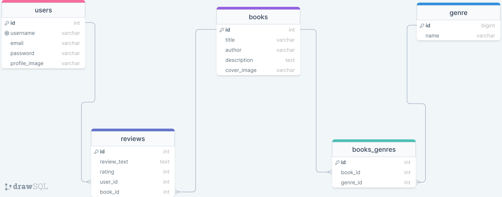

# Books-Review
-----
- This is the API backend for the books-review project .The Front-End can be found at [Front-End](https://github.com/Book-Bros/phase-4-books-client)

## Description


## Database



## Installation
1. fork or clone this repository
```bash
    git clone https://github.com/
```

2. install the necessary dependencies by bundling

3. start the database


## contributers

1. [Stephen-Nene](https://github.com/Stephen-nene)
2. [Sammy-CK](https://github.com/Sammy-CK)
3. [Samueelx](https://github.com/Samueelx)
4. [ShuaibShaban](https://github.com/ShuaibShaban)

## license
